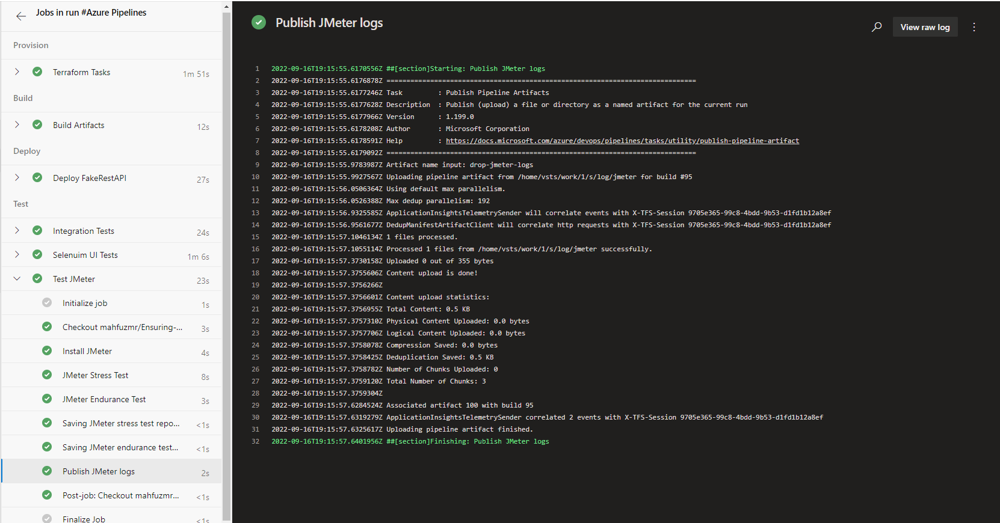
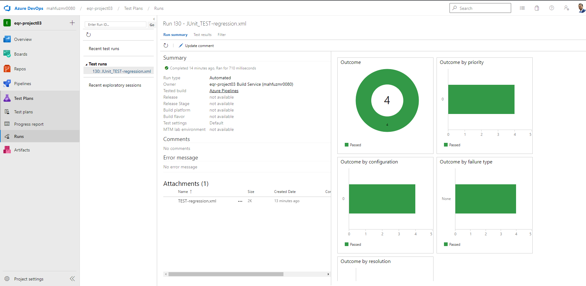
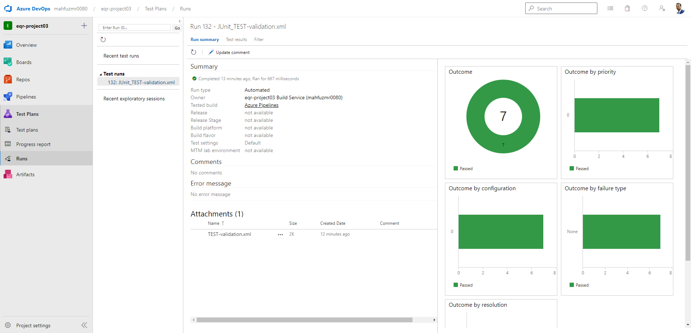
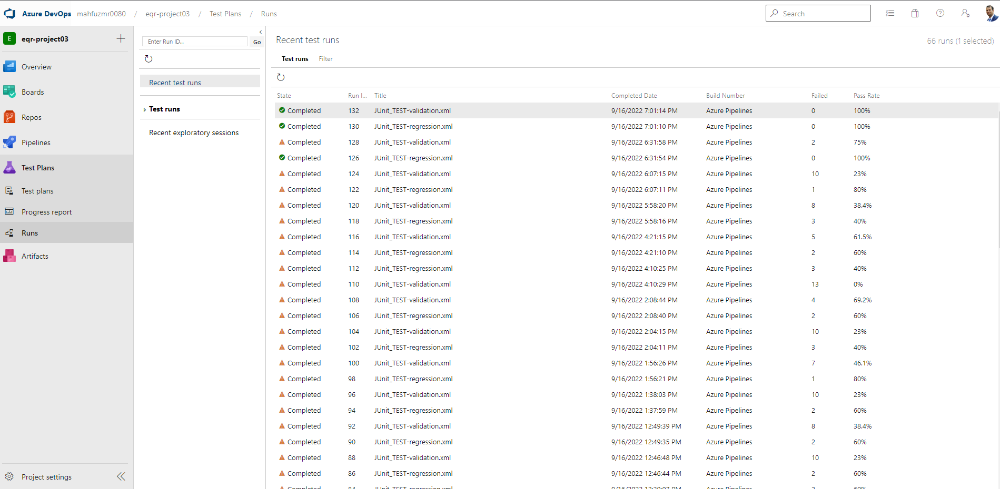

# Ensuring-Qality-release
Demo project to ensure IaC quality releases by autometed CI/CD pipeline using Azure DevOps 

## Table of Contents
* [Introduction](#introduction)
* [Installation](#installation)
* [Initial configuration](#initial-configuration)
* [Resource Creation](#resource-creation)
* [Integrade Test suites through IaC](#integrade-test-suites-through-iac)
* [Testing phases](#testing-phases)

## Introduction
To ensure quality release our target is to ensure release that are filly automated from development till testing. Each of the testing phase contains full automated testing on different environment. And when the deployment meets all the requiremnts then the CI/CD will deploy the autometically ot the corresponding app service.
In this demo project this process has been demonestratd: through following system diagram.


## Installation

For the successful run of this project we need to do the following prework:
1. Install Visual Studio Code: https://code.visualstudio.com/
2. Create an Outlook Account: https://outlook.live.com/
3. Create a free Azure Account: https://azure.microsoft.com/
4. Create an Azure Devops account: https://azure.microsoft.com/services/devops/
5. Install Azure CLI: https://docs.microsoft.com/cli/azure/install-azure-cli?view=azure-cli-latest
6. Install Terraform: https://learn.hashicorp.com/tutorials/terraform/install-cli#install-terraform
7. Install the Java Development Kit: https://www.oracle.com/java/technologies/javase/javase-jdk8-downloads.html
8. Install JMeter: https://jmeter.apache.org/download_jmeter.cgi
9. Install Postman: https://www.postman.com/downloads/
10. Install Python: https://www.python.org/downloads/
11. Install Selenium for Python: https://pypi.org/project/selenium/
12. Install Chromedriver: https://sites.google.com/a/chromium.org/chromedriver/downloads

## Initial configuration
Before using Infarstructure as code provisioning we need to create 
* Login to azure account
* Resource group
* Storage account
* container
* connection access_key

### Configuration

    1. First, we have to ensure we are logged in into Azure CLI 
        Command:
        ```Bash
        az login
        ```
    2. Once that's done, we run the ```config.sh``` file. 
        Command:
        ```Bash
            sh terraformconfig.sh
        ```
    3. Following output we need to save
        - storage_account_name
        - container_name 
        - access_key
    4. As per project requirement we are creating directory In the ```main.tf``` in the ```environments\test``` .
    5. Replace the gaind out put 

        ```Bash
        terraform {
            backend "azurerm" {
                storage_account_name = ""
                container_name       = ""
                key                  = ""
                access_key           = ""
            }
        }
        ```
    6. Create a service principle.
        Command:
            ```Bash
                az ad sp create-for-rbac --role="Contributor" --scopes="/subscriptions/your-subscription-id"
            ```
        
            We will get an output similar to this:
            ```Bash
            {
            "appId": "00000000-0000-0000-0000-000000000000",
            "displayName": "azure-cli-2017-06-05-10-41-15",
            "name": "xxxxxxxxx-cfbe-4f86-947e-000000000000",
            "password": "0000-0000-0000-0000-000000000000",
            "tenant": "00000000-0000-0000-0000-000000000000"
            }
            ```
            Where - appId is the client_id, password is the client_secret, tenant is the tenant_id.

            Replace each value into ```terraform.tfvars```
## Resource Creation
Before running the pipeline make sure to install the Terraform extension 

Now run the pipeline to execute above configuration and create resources. A successful pipeline provision, build deploy will look like:

Terraform provissioning


After execution terraform now it the build stage.


Now its time to deploy FakerAPI to our application service


After deployment created resource can be shown in the azure portal Home > Resource group > Resource Visualizer :


Our system is now ready for integrading test phase.


## Integrade Test suites through IaC
After implementing code for each of the test suites in the ``` azure-pipelines.yml ´´´ 

We can save and after succesfull execution the output of the test will be as follows:


Some times based on the load test could be fail because resource limit reached. []

If the test phase succeed the complete pipeline will show following output


Azure pipeline build results can be shown as:


## Testing phases
    We run 3 different test stage consists of three different steps:
    * [Jmeter Tests](#integration-test)
    * [Postman Tests](#performance-tests)
    * [Selenium UI Tests](#ui-tests)

Each of the tests are done on the given demo application (App url are given insite the script). those are :
1. https://www.saucedemo.com/ (demo shoping site for UI Test)
2. https://dummy.restapiexample.com/ (demo API for Postman testing)
3.  https://p3testapp-appservice.azurewebsites.net (for our own app service performance test using JMeter)

### Jmeter Tests

After execution of the pipeline job for Jmeter Test suite following is the output:

 

After successfully test execution of JMeter for endurance an stress test locally the following are the output reports:

* Endurance test report

 

* Stress test report

 

### Postman Tests
After execution of the pipeline job for Postman Test suite following is the output:


* regression test result


* Validation tets rsult


* Test result summery


## Selenium UI Tests

After execution of the pipeline job for Selenium test suite following is the output:


Output window of the selenium with Which user looged in, How many product added then remove.


##
##
##
